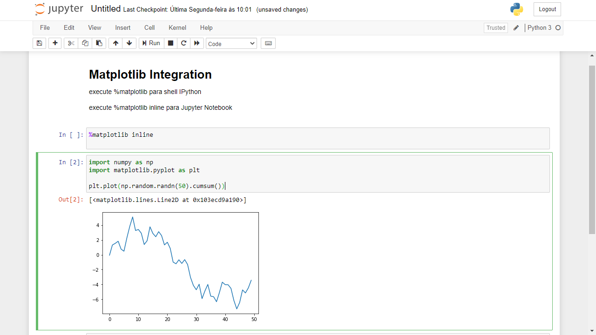

<h1>Aprendizagem Python</h1>

<b>O Zen do Python, por Tim Peters</b>
<ul>
    <li>Bonito é melhor que feio.</li>
    <li>Explícito é melhor que implícito.</li>
    <li>Simples é melhor que complexo.</li>
    <li>Complexo é melhor que complicado.</li>
    <li>Linear é melhor do que aninhado.</li>
    <li>Esparso é melhor que denso.</li>
    <li>Legibilidade conta.</li>
    <li>Casos especiais não são especiais o bastante para quebrar as regras.</li>
    <li>Ainda que praticidade vença a pureza.</li>
    <li>Erros nunca devem passar silenciosamente.</li>
    <li>A menos que sejam explicitamente silenciados.</li>
    <li>Diante da ambigüidade, recuse a tentação de adivinhar.</li>
    <li>Deveria haver um — e preferencialmente só um — modo óbvio para fazer algo.</li>
    <li>Embora esse modo possa não ser óbvio a princípio a menos que você seja holandês.</li>
    <li>Agora é melhor que nunca.</li>
    <li>Embora nunca freqüentemente seja melhor que já.</li>
    <li>Se a implementação é difícil de explicar, é uma má idéia.</li>
    <li>Se a implementação é fácil de explicar, pode ser uma boa idéia.</li>
    <li>Namespaces são uma grande idéia — vamos ter mais dessas!</li>
</ul>

<h1>O repositório</h1>

Contêm minhas resoluções dos exercícios dos desafios propostos no Curso de Python 3 do professor Gustavo Guanabara, em seu canal do youtube.

- [x] Curso Python 3 - Mundo 01
- [ ] Curso Python 3 - Mundo 02
- [ ] Curso Python 3 - Mundo 03

Em progresso...
<h1>Análise de Dados</h1>

